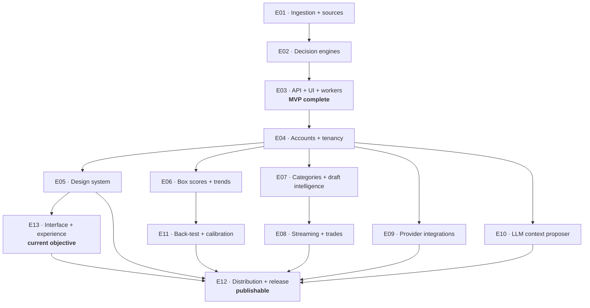

# Epics

Thirteen phased builds from the current state to a publishable, self-hostable
product. Each has a paste-ready prompt, its own concepts, its own required test
rows, and an exit gate. **Each lands independently green** — you can stop between
any two.

**Current objective: [E13](E13-interface-and-experience.md).** The engines answer
the question; E13 is whether a person can get to the answer and want to stay. It
is the only epic that adds no capability.

**Proposal awaiting owner review:** [React migration and Liquid Glass experience
plan](../plans/react-liquid-glass-migration.md), with [UI references and photo
inventory](../plans/react-liquid-glass-references.md). This planning document does
not replace E13, approve dependencies, or change the canonical Blazor stack.

**Next execution proposal:** [React/API integration and league-aware player intelligence](../plans/react-api-player-intelligence-execution.md) sequences the React port, real API acceptance checks, E06 box scores/trends, and selected E09 league imports. The owner selected draft preparation/live draft, an ESPN-default starter, and above-expected scoring heat. Broader league adapters are deferred; this link does not promote any epic status.

## Order and dependencies



| # | Epic | Requirements | Depends on |
|---|---|---|---|
| E01 | Ingestion pipeline and data sources | R2, R3, R4 | — |
| E02 | Projection, draft, and context engines | R7, R8, R9, R10 | E01 |
| E03 | API, Blazor UI, workers — **MVP complete** | R1, R6 | E02 |
| E04 | Accounts and tenancy | R20 | E03 |
| E05 | Design system and accessibility | R19 | E04 + **your `DESIGN.md`** |
| E06 | Box-score importer and trend engine | R11 | E04 |
| E07 | Category analyzer and draft intelligence | R12, R13 | E04 |
| E08 | Streaming advisor and trade analyzer | R14, R15 | E07 |
| E09 | Provider integrations | R16 | E04 |
| E10 | LLM context proposer | R17 | E04 |
| E11 | Back-test and calibration | R18 | E06 |
| E13 | Interface and experience — **current objective** | R23 | E05 |
| E12 | Distribution, observability, release — **publishable** | R21, R22 | E05, E08, E09, E10, E11, E13 |

## Why auth is fourth, not last

Ownership is retrofitted onto the schema, and the isolation sweep
(`test_matrix_auth_tenancy.md` row U-01) **enumerates owned routes by reflection**.
Landing it early means every endpoint E05–E11 adds is covered automatically, and
each epic pays only the cost of marking new entities `IOwnedResource`.

Landing it last would mean retrofitting ownership across a dozen endpoints at once
and hoping the sweep list was complete — the highest-risk ordering available, for no
benefit.

## Parallel lanes

After E04, four lanes are independent and can run in separate worktrees:

```text
lane A   E06 → E11
lane B   E07 → E08
lane C   E09
lane D   E10
lane E   E05   (blocked on DESIGN.md, which is yours to produce)
```

Merge conflicts concentrate in three files — `Directory.Packages.props`,
`Program.cs` DI registration, and `ARCHITECTURE.md`. Keep each lane's edits to those
files minimal and additive, and land lanes one at a time.

## What every prompt shares

Each one restates only what a fresh session cannot infer from the repo:

- **Authorization** to implement, edit, run, and commit.
- **Read order** into the spec stack and the routing index.
- **Scope**: the epic's requirements and nothing else.
- **Exit gate**: the specific test rows plus a green `scripts/gate.sh`.
- **Budget ladder** and the wrap-up protocol.
- **Non-negotiables**: pins, forbidden patterns, safety concepts, no placeholder
  files.

Nothing in a prompt restates a contract. If a prompt and a concept disagree, the
concept wins — and the prompt is the bug.

## Before any run

```bash
dotnet --list-sdks          # a 10.0.x SDK
docker info                 # running
python3 context/validate_okf.py   # exits 0
scripts/gate.sh             # green on the current tree
```

A dirty or red tree before an epic makes every failure inside it ambiguous.

## After each run

Grade the context, not just the code — `ONE_SHOT_PROMPT.md` has the Phase 4
protocol. Root-cause each defect to whether its invariant was **executable or
prose**, and add the missing check in the same commit as the fix. That loop is what
makes the bundle worth more after each epic than before it.
