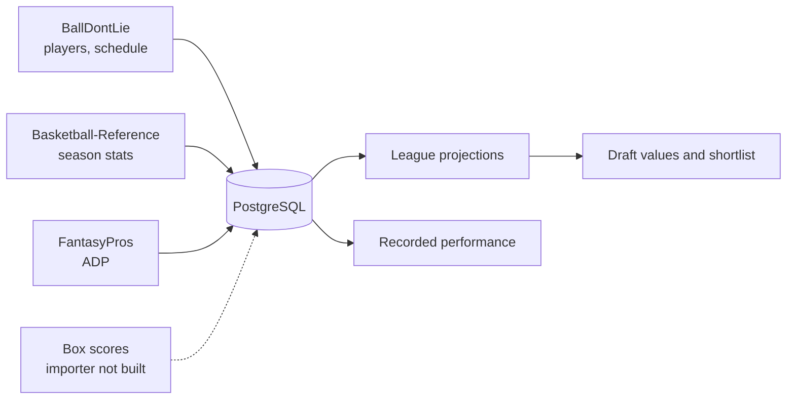

# Fastbreak: Path to a Functional App

As of 2026-09-22 · Exported from the [Claude Doc](https://claude.ai/code/artifact/2c78735a-bc49-420d-b7bb-68676b75e6a3)

Implementation decisions and verification targets are in
[the functional app implementation solution](functional-app-implementation-solution.md).
The provider and box-score notes below describe the state at export; consult that
solution and the stable source policies before implementing imports.

The React app at `/app` covers sign-in through a live snake draft, plus the account, league, import, and context screens added in this checkpoint. A fresh database still has no players, stats or game logs, so projections and recorded performance remain empty until the owner imports data.

The formerly disconnected API features now have React screens. Trade, streaming,
and standings still have no engine behind them; their destinations explain that
limitation. Live game ingestion and the new player intelligence remain future
work.

## Status at a glance

The functional React route gaps now use existing APIs or the two added endpoints. Engine capabilities without an implementation remain explicit not-built pages or explanations.

| Feature | React screen (`/app`) | API endpoints | Needs data from | Status |
| --- | --- | --- | --- | --- |
| Sign in, register, sign out | Landing “Let’s win your league” section | `/api/account/session`, `antiforgery`, `register`, `login`, `logout` | — | Connected |
| Create a points league | “Your rules. Your court.” form | `GET /api/leagues/setup`, `POST /api/leagues` | ESPN scoring catalog (built in) | Connected |
| League projections | “Prepare league projections” | `GET .../projection-pools`, `POST .../projections` | Season stats import | Connected, no data yet |
| Player search and detail | Player pool, player detail panel | `/api/players`, `/{id}`, `/{id}/projection` | Players import | Connected, no data yet |
| Snake draft, pick, undo | Draft section, current pick | `/api/drafts`, `/{id}`, `/board`, `/picks` | Projections for draft values | Connected, no data yet |
| Next-pick shortlist | “Next-pick shortlist” | `GET /api/drafts/{id}/recommendations` | Projections | Connected, no data yet |
| Recorded performance (heat) | “Recorded performance” panel | `GET .../performance-pools`, `.../performance` | Box-score importer (not built) | Connected, no data yet |
| Category leagues | Setup form supports explicit categories; analysis remains points-only | `POST /api/leagues` (type Category) | — | Setup connected; category draft intelligence unavailable |
| Edit league scoring and settings | React league settings page | `PUT /api/leagues/{id}/scoring`, `PUT /api/leagues/{id}/settings` | — | Connected; explicit recalculation required after scoring edits |
| Data imports and freshness | Owner-only React page | `POST /api/imports/{players, season-stats, schedule, adp}`, `GET /api/imports/runs`, `GET /api/health/data-sources` | BallDontLie API key for players/schedule | Connected; no import invoked in this implementation |
| Context review (injuries, news) | React create, verify and reject | `/api/context-events`, `/verify`, `/reject` | Human-entered events | Connected |
| Account export, import, delete | React account data page | `GET /api/account/export`, `POST /import`, `DELETE /api/account` | — | Connected |
| Saved drafts list | React per-league list with reopen links | `GET /api/drafts?leagueId=` | — | Connected, owner-scoped and paged |
| Trade analyzer (R15) | Honest React explanation page | None | — | No engine yet |
| Streaming advisor (R14) | Honest React explanation page | None | — | No engine yet |
| Standings and leaderboard | Honest React explanation page | None; deferred, not scoped | — | No engine yet |
| Seasonal and draft player labels | Documented only | None | Completed per-game observations and verified injury history | New owner-requested feature; contract and offline goldens first |

## Functional screens delivered in this checkpoint

Every functional React screen uses the existing `api.ts` wrapper: same-origin cookies, a fresh anti-forgery token per change, and no automatic retry of changes.

**Existing API connected to React**

1. **Data sources (owner only).** Buttons to run the players, season-stats, schedule and ADP imports, a runs list, and freshness per source.
   - `POST /api/imports/*` and `GET /api/imports/runs` require the `Owner` role. Show the screen only when `session.user.isInstanceOwner` is true.
   - Freshness comes from `GET /api/health/data-sources`.
   - This unblocks everything else, because it is how data gets in.
2. **Edit league scoring.** A “League settings” panel that reuses the setup form's scoring grid and saves with `PUT /api/leagues/{id}/scoring`.
   - After a save, prompt “Recalculate projections”, since draft values go stale.
3. **Category leagues.** Add a Points / Category choice to the setup form and send `type` plus `categories`.
   - The draft, shortlist and performance panels remain points-only today (`league.type === 0`). The React workspace states this limitation rather than presenting points values as category advice.
4. **Context review.** List, add, verify and reject injury and news events through `/api/context-events`.
   - Keep the rule that unverified context is labelled until a person verifies it.
5. **Account data.** Export, import and delete-my-account buttons on `/api/account/export`, `/import` and `DELETE /api/account`.
   - Put a typed confirmation step before delete.
6. **League switcher polish.** `GET /api/leagues/{id}` exists, but React loads the full list and filters it. Only change this if the list grows past 200 leagues.

**New endpoint and React screen delivered**

1. **Saved drafts list.** There is no `GET /api/drafts?leagueId=` today, so a draft can only be reopened from a bookmarked URL. Add the endpoint, scoped to the signed-in user, then a “Your drafts” list under the league bar.
2. **Edit league name, teams, cadence and roster slots.** Only scoring can be changed after creation. Add an endpoint, and decide what happens to an in-progress draft when the team count changes.

## Data pipeline

Four of the five data feeds are built and just need to run. The fifth, game logs for recorded performance, has a parser and storage but no importer. It is blocked on a scraping-policy decision.

Solid arrows exist today. The dotted arrow is missing.

| Feed | Source | How it runs | What is left |
| --- | --- | --- | --- |
| Players | BallDontLie API | `POST /api/imports/players` (owner) | Supply a real `BallDontLie__ApiKey` through the local secret configuration before startup. No live import was run in this checkpoint. |
| Schedule | BallDontLie API | `POST /api/imports/schedule`, plus a daily `ScheduleRefreshWorker` | Same key. Workers start 1–10 minutes after boot and repeat daily. |
| Season stats | Basketball-Reference per-game, totals and advanced pages | `POST /api/imports/season-stats`, plus a daily `StatRefreshWorker` | Run the owner import, then explicitly calculate projections per league. |
| ADP | FantasyPros `/nba/adp/overall.php` or pasted CSV | `POST /api/imports/adp`, plus a daily `AdpRefreshWorker` | Nothing, allowlisted |
| Game logs (box scores) | Basketball-Reference `/boxscores/` | Not built | 1. Resolve the conflict: the allowlist table excludes `/boxscores/` but the policy's prose implies it. This is a safety rule and needs your decision, not a code change. 2. Check the parser against a real saved page (tests use a synthetic one). 3. Build player/game identity and final-status checks. 4. Build a resumable importer with visible progress. |

**Order to load a working instance:** players, then season stats, then “Calculate projections” on each league. Draft values and the shortlist appear after that. Recorded performance stays empty until the game-log importer exists.

## Front-end follow-up

The app still runs React at `/app` and the older Blazor pages at `/`. Moving every route to React is milestone M7 in the execution plan.

- [x] Check the phone-width curve under the photo strips at 390px; the browser screenshot was reviewed.
- [ ] Restyle the Blazor pages (dashboard, data sources, context review) to match, or retire each one as its React screen lands.
- [ ] Point the Blazor dashboard's “Open the React draft workspace” link and the React “Existing app” link at the right place once routes move.
- [x] Link player/stat empty states to the React Data sources screen and describe the unavailable game-log importer accurately.
- [ ] Portfolio repo hygiene (outside this app): `Skipa776/portfolio` is still Bettina Sosa's code and details, and its homepage link serves a different site (“Saikumar”).

Skipped on purpose from the portfolio: the “Hola / Hello” loading screen, which would add about a second to every load, and the custom cursor.

## Verification and release

The 2026-09-22 full gate passed 279 tests after the redesign and functional pages: 93 Domain, 37 Application, 149 Integration. React and .NET builds had zero warnings; the browser journey, mobile overflow checks, draft-row stability, coverage floors, and OKF validator passed. The owner live-data import and visual acceptance remain pending.

| Check | Command | Last result |
| --- | --- | --- |
| Full gate: format, build, all tests, bundle validator | `docker compose up -d --wait` then `scripts/gate.sh` | Passed on 2026-09-22 |
| React browser journey (register, league, draft, undo, performance, functional routes, axe, mobile) | Runs inside the gate's integration tests | Passed on 2026-09-22 |
| Image licence check (D-34) | `dotnet test --filter D34` | Passed with 8 photos |
| Owner visual acceptance | You review `/app` | Pending |

After data loads, add one check the gate cannot cover: a real import of players and season stats on a scratch database, then calculate projections. Confirm the shortlist shows real names and values.

Release work in milestone M7: move the remaining routes to React, set up production hosting and secrets (connection string, BallDontLie key, HTTPS), then a full regression run and your sign-off.

## Ordered checklist

Live data is next because it makes the connected screens useful with real
players. The remaining list records source and release dependencies.

- [x] 1. Run `scripts/gate.sh` on the redesign and functional routes; commit after the final review.
- [ ] 2. Add a real BallDontLie key to `.env`, then import players and season stats through Blazor `/data-sources`.
- [ ] 3. Calculate projections for a test league and draft a few picks to confirm real values end to end.
- [x] 4. Build the React Data sources screen (owner only): imports, runs, freshness. No import was invoked.
- [x] 5. Add the saved-drafts list endpoint and the “Your drafts” screen.
- [x] 6. Build React league settings: scoring edit, plus the endpoint for name, teams and roster. Structural edits are refused once a draft exists.
- [ ] 7. Decide the `/boxscores/` scraping-policy conflict, then build the game-log importer so recorded performance shows real games.
- [x] 8. Build React context review and account export/delete.
- [x] 9. Add category leagues to the React setup. Category draft analysis is explicitly shown as unavailable rather than using points rankings.
- [ ] 10. Retire or restyle the Blazor pages, then do milestone M7: production hosting, full regression, your sign-off.
- [ ] 11. Later epics, not needed for a working app: trade analyzer (R15), streaming advisor (R14), standings.
- [ ] 12. Implement the documented [seasonal player evidence contract](../../context/codebase_okf/contracts/player_season_intelligence_contract.md) after the source, sufficiency, and threshold decisions are resolved; show qualified labels in player detail and the pre-draft room.
