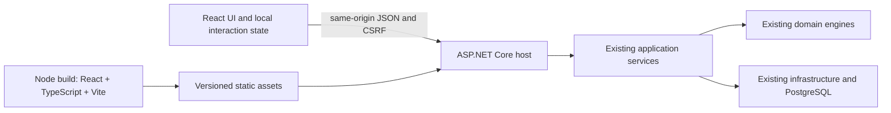

# Fastbreak: React migration and Liquid Glass experience plan

**Status: migration plan retained; owner selected one continuous, more animated Maxima-led landing page. Production implementation not approved.**  
**Prepared:** 2026-09-18. **Visual revision:** 2026-09-19. **Code baseline:** `a2830e9`.  
**Deliverable:** a migration plan, experience specification, reference research, interactive visual prototype, Playwright audit, and owner decision checklist. No production migration or canonical design replacement is authorized by this document alone.

The requested destination is a modern React frontend with basketball identity built on the expressive interaction foundations of Maxima Therapy and Sam Walks. Apple-inspired materials are a supporting navigation treatment. The proposal keeps the C# decision engine, existing data, and explainability guarantees. The owner will review this plan before implementation.

Start with the [visual review packet](visual-review/README.md) and [continuous landing study](visual-review/landing.html), then read the [reference and asset dossier](react-liquid-glass-references.md). Recommendations below are proposals, not decisions silently substituted for the current specification.

**Execution follow-up (2026-09-19):** [React/API integration and player-intelligence plan](react-api-player-intelligence-execution.md) turns the next work into milestones and separates existing scoring services from the missing box-score/trend engine. The owner selected draft-first delivery with an editable ESPN-default starter profile and above-expected scoring heat; the owner selected an expanding 10-to-30-game baseline followed by a rolling 30-game average and seven teams initially, expandable to eleven or more. The hot-streak window is the latest three games, using the baseline from before that window; remaining roster/draft settings are open.

## 1. Review decisions

The owner rejected the original Arena Glass appearance as generic and explicitly selected Maxima Therapy and Sam Walks as primary inspirations, with SimplyRaffle, Webharu and Konny Amaya as backups. That reference hierarchy is an accepted instruction. On September 19, the owner requested more Maxima-inspired animation and one continuous scrolling page as the main landing experience. That page structure and motion direction are selected; final visual acceptance and production migration approval remain pending.

| Decision | Proposed starting point | Alternatives / question for the owner | Status |
|---|---|---|---|
| Visual foundation | **One continuous Maxima-led landing**, basketball identity on top; Sam Walks supports discovery and wayfinding | Review exact composition, motion intensity and final art; both production themes remain required | Main page structure and animation direction selected by owner |
| Redesign scope | All 14 existing routes, with existing functionality and clearly labelled unbuilt surfaces | Prioritize draft/players/leagues, or include separately scoped future capabilities? | Recommended; owner review |
| Photography | Use the compositions of `inspiration-resources/`; ship only images with documented reuse permission | Are Curry/LeBron the intended files? Can their source, photographer, and licence be supplied? Should they remain mood references while cleared replacements are acquired? | Recommended; owner review |
| Amount of glass | Visible glass on navigation, league switcher, and transient controls; solid data and form surfaces | Prefer very subtle frost or stronger edge highlights and translucency on public surfaces? | Recommended; owner review |
| Brand | Keep **Fastbreak**; test existing local Anton display type, a court-derived palette and original geometric illustration | The new studies compare expressive public composition with a dense instrument; exact palette still open | Proposed in round 2 |
| Image placement | Landing and auth only for the first release | Also allow a compact image on the signed-in home page or player detail? This changes the current image-free instrument rule. | Recommended; owner review |
| Desktop/mobile emphasis | Desktop draft workflow first; phone parity for every existing action | Is phone drafting equally important, or is mobile mainly player research and review? | Recommended; owner review |
| Navigation | Existing Decide / League / Data grouping; mobile menu; defer dock and command palette | Add a labelled mobile dock and/or a keyboard navigation palette? Both are optional interaction work, not prerequisites for React. | Recommended; owner review |
| Player detail | Split view on wide screens, full-width detail on phones, with URL state | Prefer a sheet over the list? Preserve direct links, Back, and focus either way. | Recommended; owner review |
| Unbuilt destinations | Keep Trade, Free Agents, Leaderboard as explicit documented absences | Hide them until their backend epics land? Removing them changes the previously chosen navigation evaluation scope. | Recommended; owner review |
| Motion | Rotating hero wheel, spring sign, ball bounce, sticker responses, scroll reveals, court-line drawing and restrained parallax on the public page | Review motion intensity in the continuous study; reduced motion and direct workspace access are mandatory | More Maxima-inspired public animation requested by owner |
| Rendering | React SPA for all final UI routes; temporary server-rendered auth during transition | Accept client-rendered public content, or require initial HTML/SEO and a no-JavaScript sign-in path? See section 7. | Recommended; owner review |
| Dependency set | React, TypeScript, Vite, React Router; custom CSS and components | Approve the proposed tooling and, if justified by the spike, headless virtualization/test tools? See section 8. | Recommended; owner review |

**Review shortcut:** scroll the continuous landing from top to bottom, try the wheel and hanging sign, then compare with Reduce motion enabled. Then confirm photo permissions or replacements and acceptance of JavaScript-dependent final public/auth UI. The default scope is existing capabilities only. Dock, palette, historical draft browsing, extra imagery inside the workspace, and new engine features are excluded from the first release.

## 2. What the migration changes

### Existing implementation, verified from files

- 14 routed page components; 34 design components; 53 Razor files in total, approximately 3,900 lines. There are 36 scoped CSS files and three browser scripts. Counts describe the review baseline, not an estimate of equivalent React code.
- `ApiHost.cs` hosts Interactive Server Razor components in the same ASP.NET Core process as the HTTP API. Pages call scoped application services directly.
- The draft combobox filters and handles arrow keys in C#; the circuit carries those interactions. Its browser script preserves board scroll position.
- `PlayerTable.razor` uses Blazor virtualization. Page and design models directly reference C# domain types and enums.
- Identity cookies, CSRF protection, resource authorization, and EF ownership filters already exist.
- `LeagueService.ListAsync`, draft-session retrieval, and context-impact overrides are used by pages but not all exposed through JSON endpoints.
- The latest frontend commit is a functional simplification. Current tokens disable shadows and wood texture and point the display face at the system sans. Parts of `DESIGN.md` describe an earlier, more decorative implementation.
- Several design tests inspect Razor source or server-rendered markup. They are not automatically React tests.
- `distribution_and_operations.md` remains planned. A container-image release is a product target, not a completed asset this migration can assume.

### Reuse and replacement

| Keep | Rebuild or adapt |
|---|---|
| Domain scoring, projection, draft, and context engines | Razor pages and presentation components as React components |
| PostgreSQL records, migrations, repositories, workers, provider policies | Page data access through authenticated HTTP contracts |
| Application services and business validation | Form state, routing, focus restoration, request cancellation, mutation handling |
| ASP.NET Identity, cookies, tenancy enforcement | Client session/bootstrap handling and auth-expiry behavior |
| Product terminology, evidence and projection decomposition | UI tests, route enumeration, token scans, browser coverage |
| Token vocabulary and accessibility intent | Actual palette/material values and CSS isolation strategy, after visual approval |
| Existing API tests and engine goldens | Node build/test integration and production asset packaging |

This is a substantial frontend rewrite with API completion work. React's strongest specific benefit here is local interaction responsiveness; it does not make the ranking engine faster or make a design coherent on its own.

### Compare the options before committing to React

| Question | Refine existing Blazor | Move to React as proposed |
|---|---|---|
| Can it deliver this visual design? | Yes. Typography, layout, imagery, and glass are CSS concerns | Yes; React is not required for the aesthetic |
| Draft typing and selection | Current C# handlers travel through the server circuit; targeted browser-side interaction could reduce that dependency | Filter text, highlighted option, and open controls can respond locally; ranking and authoritative picks still require the backend |
| Reuse | Retains Razor components, direct service calls, and most current UI checks | Retains engines and services, replaces presentation and adapts the test suite |
| New boundary work | Limited for a presentation-only redesign | Required JSON adapters, session bootstrap, CSRF/error handling, query state and build integration |
| Operations | Current single .NET toolchain and persistent interactive circuit | Same ASP.NET origin; Node build/test toolchain; no persistent Blazor circuit for migrated UI |
| Main risk | Incremental interaction patches become inconsistent unless deliberately designed | Rewrite cost, API gaps, parity regressions, and prolonged mixed-frontends transition |
| Proof needed | Updated designs plus real keyboard/responsive checks | The same checks plus measured draft latency, engine-result parity, production build and rollback |

**Recommendation:** React is feasible and fits a future of richer local interactions, but do not approve it solely to obtain Liquid Glass. Approve the visual direction independently, then make the Phase 2 draft slice the go/no-go checkpoint. The HTML concept supplied here proves neither React performance nor the business case for the rewrite. If that slice fails to justify the additional complexity, apply the approved visual system to Blazor and stop the migration without changing the engine.

## 3. Scope and product truth

**Included in the proposed migration:** parity for existing pages, route reachability, league selection, account flows, player search and decomposition, draft creation/picks/undo, context creation/review/overrides, import controls and health, both themes, responsive behavior, and necessary API adapters for those operations.

**Optional UX additions for explicit selection:** labelled mobile dock, navigation-only command palette, player-detail sheet, filter chips, and a resumable existing draft if the owner chooses to expose that experience. Draft-state retrieval is required for correct HTTP-based rendering; adding a history/list/resume product workflow is a separate decision.

**Included interaction refinement:** selected player and search/filter state in the URL, with Back/reload behavior, using existing data.

**Not part of this migration:** new recommendation formulas, live NBA scores, standings, trade computation, streaming plans, OAuth providers, news ingestion, LLM recommendations, payment systems, social features, or an offline draft queue. Designs may identify where future work belongs without showing fabricated numbers or functioning controls for absent capabilities.

Existing guardrails survive:

- The UI formats engine results; it does not compute scores, confidence, risk, or projection adjustments.
- Baselines remain immutable; human review remains necessary for verification.
- Recommendations retain evidence and visible risks; projections retain their decomposition.
- Owned data never crosses users. New endpoints extend the existing authorization sweep.
- A visual reference is not permission to copy its assets, code, claims, or features.
- No CSS framework or third-party styled component kit. Approving React does not approve a replacement visual library.
- The draft interaction budget, density, and accent rules remain owned by the [design-system contract](../../context/codebase_okf/contracts/design_system_contract.md).

## 4. Revised visual foundation — continuous landing, round 3

The original Arena Glass prototype was rejected. It is retained only as a historical artifact, never as an implementation target. The owner chose the first two AI-assisted references and asked to establish their foundations before adding basketball identity.

### Primary sources and translation

- **[Maxima Therapy](https://maximatherapy.com/):** bold full-scene composition, oversized expressive typography, original illustrated forms, a tactile carousel, and interaction that changes the view. Borrow those relationships and behaviors, not the source's characters, artwork, logo, exact copy or implementation.
- **[Sam Walks](https://sam-walks-site.vercel.app/):** user-controlled progress through a spatial scene, landmarks, a visible index, and a sense of discovery. Translate that into an optional court-side introduction with direct access to the workspace. No forced game before signing in or drafting.
- **Backup sources:** SimplyRaffle for a coherent visual identity, Webharu for comparison/review of multiple concepts, Konny Amaya for a deliberate design-to-code handoff. Use them when solving a specific remaining problem, not to dilute the two primary references.
- **Apple:** physical feedback, clear gesture equivalents, reduced-motion support and restrained glass navigation. Glass is not the visual concept by itself.

### Current composition: one continuous landing

The [round-3 landing](visual-review/landing.html) is now the main review target. It uses ordinary vertical document scrolling: illustrated hero → league/court section → context/photo spread → draft/sign section → closing workspace CTA. The header anchors jump within the same page. A persistent workspace link bypasses the public narrative. Hero perspective changes do not change routes.

Maxima provides the primary motion vocabulary: rotating artwork, physical objects, scroll-driven reveals, sticker response and a morphing CTA. The study uses original CSS/SVG/JavaScript and no new dependencies. Sam Walks remains a supporting source for discovery and visible progress; its sideways journey is retained only as an earlier alternative. The other references remain backups.

See the [motion specification and browser evidence](visual-review/README.md). Production motion must use the selected design tokens, clean up observers/animation frames on unmount, honor changed accessibility preferences, and preserve all dense-workspace constraints. The local spring code proves the interaction concept, not production performance or a final animation-library choice.

### Earlier three-direction comparison

| Direction | Foundation | Basketball layer | Working interaction | Tradeoff |
|---|---|---|---|---|
| **Courtside** | Maxima-led: one bold scene, large type, playful geometry and physical chapter changes | Illustrated court/hoop/ball, local action-photo study, Fastbreak identity, existing Anton face | Drag, arrow keys or buttons through league/context/pick perspectives | Strong personality; needs owner judgment on playfulness and illustration quality |
| **Walk the Floor** | Sam-led: spatial exploration, landmarks and an index | Night-court atmosphere, fictional walking figure, Curry/LeBron poster studies, research-to-draft narrative | Drag, slider, scene buttons, hold-to-explore and accessible scene index | Most immersive; keep optional because it is slower than direct navigation |
| **Film Room** | Functional synthesis of expressive type and clear spatial grouping | Court-inspired palette and naming; photo-free decision area | Fixture search, keyboard selection/pick, undo and projection breakdown | Most practical; less spectacle once working |

The [interactive study](visual-review/directions.html) has a **Show design foundation / Add basketball identity** toggle. It removes prominent athlete photography, brand wording and selected sports details to expose the structure. It is a design-study aid, not a proposed production setting or a second complete brand.

The studies use distinct palettes appropriate to each composition. They do **not** constitute finished light/dark themes for all routes. After owner selection, resolve both production themes and the auth/error/first-run states before porting. No theme or accessibility requirement is retired.

### Design acceptance before implementation

1. Owner reviews the selected continuous composition and increased animation using the rendered round-3 prototype, including its reduced-motion version.
2. Translate that identity into the existing draft density without changing ranking semantics, adding decorative row animation, or inserting photos into fictional player data.
3. Review final typography, crops, iconography, responsive hierarchy, both themes and composited material contrast.
4. Use the React draft spike to establish actual transport/interaction parity. The static studies cannot prove this.

## 5. Liquid Glass on the web

Apple's [Materials guidance](https://developer.apple.com/design/human-interface-guidelines/materials) separates navigation/control materials from the content layer. This proposal translates that hierarchy to web CSS; it does not promise Apple's native optical rendering or native APIs in React.

### Material placement

| Surface | Proposed material | Reason |
|---|---|---|
| Public navigation over photography | Clearer glass, with a guaranteed readable backing | Lets the image remain visible while separating controls |
| Workspace utility bar and league switcher | Frosted glass with stronger opacity | Gives context without competing with the task |
| Mobile dock, if approved | Frosted glass; safe-area aware | Keeps a small number of destinations reachable |
| Popover/action menu | One defined raised material | Shows hierarchy without nesting glass layers |
| Authentication form, settings, evidence panel | Opaque or near-opaque standard surface | Stable reading and input contrast |
| Player table and draft rows | Opaque | Predictable contrast and unchanged visual density |
| Warning, error, confidence and source state | Opaque semantic treatment, icon and text | Meaning must not depend on the photograph beneath it |

### Rendering rules to implement after approval

1. Build with CSS background alpha, `backdrop-filter`, a restrained highlight edge, and tokenized elevation. Use a solid baseline and enhance only where supported. [MDN backdrop-filter](https://developer.mozilla.org/en-US/docs/Web/CSS/Reference/Properties/backdrop-filter).
2. Keep the functional glass layer distinct from content. Avoid translucent-on-translucent nesting, especially menus over a glass sidebar. A popover may replace the underlying material with a solid separation region.
3. Keep highlights static by default. No full-screen WebGL refraction, cursor-following distortion, continuous shimmer, or blur animation in the migration baseline. These add cost without helping a pick.
4. Define material tokens for backing, blur, highlight, border, and shadow in the single token owner. Numeric values are selected through review and measured tests, not scattered in components.
5. Test contrast on composited bright, dark, and high-frequency backgrounds. Existing flat-token contrast calculations alone cannot certify transparent surfaces.
6. Honor reduced motion, forced colors, increased contrast, and reduced transparency where supported. Provide an explicit **Reduce transparency** preference because browser support for the OS signal varies. Solid mode must retain hierarchy and visible focus. [MDN reduced transparency](https://developer.mozilla.org/en-US/docs/Web/CSS/Reference/At-rules/@media/prefers-reduced-transparency).
7. Do not position content under floating controls without reserved space and scroll padding. The last row, focused field, and validation message must remain reachable.
8. A fixed utility bar must not grow or collapse during an active draft. Pointer targets and the board viewport remain stable.

### Motion

- Immediate pressed/selected feedback; server mutations become successful only when acknowledged.
- Anchored menu and detail transitions; reversible, interruptible behavior. No delay before a control accepts input.
- Preserve the existing motion-token discipline; introduce a spring dependency only if an approved gesture actually requires it.
- Draft reranking is instantaneous presentation with scroll preservation. No FLIP animation, row sliding, number counting, or celebratory overlay.
- Public motion follows the round-3 landing: finite text reveals; scroll-linked court strokes, photo parallax and decorative rotation; user-triggered wheel, ball, sticker and hanging-sign motion. No idle loops, autoplay carousel, scroll hijacking, forced horizontal section or animation-gated CTA.
- Reduced-motion mode shows the completed composition immediately, removes parallax and springs, and preserves all navigation. A visible manual reduction control supplements the OS setting. Pause work when hidden; animation frames run only while scrolling or settling an interaction. Do not rotate supplied portraits on a timer.
- Prefer a click/keyboard-operable sheet before adding drag-to-dismiss. Any later drag gesture needs a visible equivalent close control and must not interfere with scrolling.

## 6. Photography and basketball art direction

The [asset dossier](react-liquid-glass-references.md#local-asset-inventory) records the actual files, dimensions, observed content, provenance state, and proposed use. `inspiration-resources/` is ignored by Git and must remain a reference folder; do not force-add it or execute its saved third-party HTML.

### Proposed compositions

**Landing:** use the selected continuous, Maxima-led round-3 page, with original illustrated scenes and the local photos as action or portrait studies. Avoid returning to the rejected generic headline-plus-rounded-photo-panel arrangement. Keep the primary CTA reachable without scrolling and dependent on registration availability. The LeBron photo's upward movement and basket are a useful composition reference, but its resolution is insufficient for a large high-DPI hero without a better original.

**Sign in/register:** use the supplied Riot screenshot's separation of immersive artwork and a focused form. Place the form on a stable, near-opaque surface and keep the athlete outside the text column. Curry's portrait works as a reference for the side image, not as a stretched full-screen background. Do not reproduce the screenshot's social-login buttons; those providers do not exist here.

**First-run introduction:** optional narrow photographic strip or one static portrait beside a concrete next step. Missing data remains an honest empty state. On phones, compress the image before pushing the action below the fold.

**Signed-in workspace:** default image-free. If approved, restrict photography to a compact home-page masthead or player detail, with a direct data-identity mapping and initials fallback. Never put a famous player's photo next to a fictional demo player or another player's projection.

### Image production requirements

- Keep faces, hands, ball, and hoop intentionally framed; specify desktop and mobile crops separately. Avoid a generic centered `cover` crop that cuts off the action.
- Prefer contained/editorial placements for low-resolution sources. The existing 399-pixel-wide Curry file cannot provide a crisp large desktop hero; upscaling does not create authentic detail.
- Where reuse terms permit derivative work, a cutout may overlap a quiet image field to create depth. It must not obstruct controls, crop the focal action, or become a moving parallax distraction.
- Use responsive image sources, explicit dimensions/aspect ratio, a modern compressed format with fallback, and lazy loading below the fold. Preload only the actual first-view image when measurement justifies it.
- Do not encode essential information in photography. Decorative artwork has empty alt text; a meaningful player portrait has concise accurate alternative text without duplicating adjacent labels unnecessarily.
- Record original URL, author, licence, retrieval date, permitted modifications, required attribution, source dimensions, and derivative filenames in `ASSETS.md`. Keep image licensing distinct from the code's MIT licence.
- No hotlinked photo dependency, watermark removal, invented attribution, or copied commercial-stock image. If provenance is unresolved, use the existing court artwork or a separately cleared basketball photograph.

**Policy conflict to resolve:** E13 still contains a blanket likeness ban, while later `PRODUCT.md` and `ASSETS.md` allow appropriately licensed likenesses. Both newer documents explicitly keep the two inspiration photos out of shipped assets. The owner must settle the intended policy and the implementation must reconcile these files before publishing imagery. This plan does not make a legal determination about an unknown image licence.

## 7. Target architecture and rendering

**Recommended workspace architecture:** a client React application served by the existing ASP.NET Core host. One public origin and the existing authentication scheme. Node is required for development/build/test, not necessarily as a production service. Vite documents the [manifest-based backend integration](https://vite.dev/guide/backend-integration) this supports.

Proposed location: `src/FantasyBasketball.Web/`, with `app/`, `components/`, `features/`, `api/`, `styles/`, and `public/`. These are future paths, not files to scaffold now. Keep one custom component per actual need; do not add factories, generic form engines, or a second domain model.

### State ownership

| State | Owner |
|---|---|
| Picks, ranking, evidence, projection, context review, league rules | Server services and database |
| Search text, highlighted option, open menu, pending form values | React component/feature state |
| Search/filter/page/selected-player view state | URL where useful for Back, reload, and sharing |
| Theme and reduced-transparency preference | Small local preference store; no user data or credentials |
| Active league | Existing server cookie, resolved against the current user's leagues |
| Authenticated identity | Identity cookie plus a minimal server session response |

React must not persist owned results to local storage. Clear in-memory user data on logout or account change; scope cached/query state by account and league. Never treat a client-side route guard as authorization.

### Public rendering is a decision, not an accidental regression

The current landing/auth paths have initial server HTML. A bare SPA changes that behavior. Select one before scaffolding:

| Option | Benefit | Cost / boundary |
|---|---|---|
| React SPA everywhere | Simplest all-React runtime and deployment | Public content and forms depend on JavaScript; owner must accept the change and startup-failure experience |
| React workspace plus temporary server-rendered public/auth pages | Preserves initial HTML and functional form posts during migration | Transitional mixed rendering; explicit follow-up needed to finish an all-React frontend |
| React with public prerendering or SSR | Preserves rich initial HTML with React | More build/runtime work; build-time HTML cannot embed per-instance registration availability, auth state, or owned data |

**Completed-plan recommendation:** use the React SPA for every final UI route, retaining the existing same-origin server form/API endpoints as appropriate; public content and client forms will depend on JavaScript. A static explanatory startup-failure message is required, but it is not a no-JavaScript sign-in flow. If the owner requires SEO-rich initial HTML or functional sign-in without JavaScript, select prerendering/SSR explicitly and re-estimate before Phase 1. **During transition:** retain server-rendered public/auth pages while proving the React workspace. **Final recommendation is the SPA, subject to owner review.** If the owner requires full React and initial HTML, explicitly budget a prerendering/SSR phase; do not declare the migration complete with unexplained Razor leftovers. Do not introduce Next.js, React Server Components, or a second production server without a reason tied to that requirement.

## 8. Dependencies and build policy

No package is installed by this plan. Exact versions, support requirements, and licences must be verified and pinned when implementation is approved, rather than guessing future-compatible pins here.

| Proposal | Reason | Decision |
|---|---|---|
| React + React DOM | Requested renderer and local interaction state | Required if migration approved |
| TypeScript | Explicit API and component contracts | Recommended |
| Vite + React plugin + required type packages | Asset compilation and development feedback | Recommended |
| React Router, Data Mode | URL routing, pending state, loaders/actions without a second server framework | Recommended; [official mode comparison](https://reactrouter.com/start/modes) |
| Native fetch and a small API helper | Envelope/error/CSRF/cancellation behavior | Baseline; avoid a second fetching abstraction initially |
| Headless virtualization utility, e.g. TanStack Virtual | Replace Blazor virtualization without a styled component kit | Conditional: spike must justify the package versus a small fixed-row implementation |
| Vitest + React Testing Library and DOM environment | Behavior tests for React and async controls | Proposed test dependencies |
| Playwright test tooling and axe-core integration | Real browser behavior and an additional accessibility check | Proposed; may instead extend existing Chromium tooling if equivalent coverage is practical |
| Motion library | Interruptible physical gestures | Deferred unless a selected interaction requires it |
| Redux, styled UI kit, CSS framework, chart library | No new requirement established | Not included |

Add approved npm dependencies and Node/package-manager versions to `stack_config.toml` under explicit frontend sections. One committed npm lockfile, `npm ci` in CI, strict type checks, build, and tests join `scripts/gate.sh`. The gate must also check the JS/TS dependency allowlist; existing NuGet-only scans are insufficient.

CSS Modules are the proposed component isolation mechanism, with a single token stylesheet and a small intentional global reset. Replace Blazor's `::deep` selectors deliberately. During coexistence both implementations must consume one token authority, not drift into independently edited palettes.

## 9. API and data-contract work

Inventory every direct service call before implementation; this table covers confirmed gaps and supporting needs. Proposed routes below are **not existing routes or approved canonical API names**. Final shapes belong in `ARCHITECTURE.md` and the owning OKF contracts first.

| Need | Current state | Proposed change | Required proof |
|---|---|---|---|
| League list | `LeagueService.ListAsync` is called by Razor; no JSON list route | `GET /api/leagues`, ownership-filtered and with deliberate list bounds/paging | No cross-user identifiers; UI matches current options |
| Draft state | Razor calls `DraftSessionService.GetAsync`; board response contains rankings/banner, not complete session state | `GET /api/drafts/{id}` with session/turn/pick state | Refresh after pick/undo uses server truth; wrong owner gets not-found |
| Impact override | Razor calls `OverrideImpactAsync`; no override route | Dedicated mutation route, e.g. `PUT /api/context-events/{id}/impacts/{playerId}` | Same service, authenticated reviewer, audit record, baseline unchanged |
| Session/bootstrap | Razor reads auth/config directly | Minimal session endpoint plus anonymous-safe capabilities response | No secrets; no owned content in anonymous/bootstrap cache |
| Registration availability | Register page queries users and configuration | Server-derived availability for CTA and form | First owner and closed/open registration states agree |
| Active league | HttpOnly cookie and redirecting form endpoint | JSON read/update adapter or retain compatible form post during transition | Ownership-resolved fallback; forged/stale cookie never authorizes |
| Catalogs | Razor calls `Enum.GetValues` and uses domain types | Server-delivered UI catalog and/or generated contract types | No manually duplicated stat/enum value lists |
| Board and recommendations | Existing separate routes; recommendation service obtains a board too | Reuse initially; consider one authorized view response only if measured round trips or inconsistent snapshots require it | Same ranking/evidence and no racing stale response overwrites |
| Players and projections | Existing paged JSON endpoints | Adapt current contracts; exhaust paging where full-pool behavior needs it | More than one page, maximum pool, empty and missing projection cases |
| Import actions/health | Existing route groups and services | Preserve API semantics and honest run status | No fake progress percentage or invented live connection indicator |

Contract requirements:

- Keep the response envelope and named validation errors. Handle auth, CSRF, validation, conflict, rate-limit, unavailable, and generic failure states explicitly.
- Define GUID wrappers, enum representations, dates, nullability, paging, and decimal serialization. Generate from a deliberate C# transport schema where practical; a handwritten TypeScript type plus `as` is not runtime verification.
- Preserve existing API compatibility during migration. If a cleaner transport shape is introduced, use explicit adapters/versioning rather than silently changing current clients.
- Keep editable decimal values as strings until boundary validation. The frontend must not recompute domain values with JavaScript floating-point arithmetic. Specify a display precision policy and test it against C# examples.
- Do not send passwords, provider keys, configuration secrets, or complete Identity records in bootstrap responses. Only user-visible capability flags belong there.
- Re-fetch the antiforgery token after authentication state changes. Use the existing cookie and `X-CSRF-TOKEN` mechanism; test authenticated and anonymous mutation paths.
- Cancel obsolete search requests; ignore stale results after a league change. Disable duplicate draft mutation submission, but do not discard the user's search input when a pick fails.
- Reconcile uncertain mutation outcomes by reading server state. Do not automatically replay a mutation unless its contract explicitly permits it. Idempotent pick keys remain authoritative.
- No new push hub is required for parity. Refresh after this browser's mutations. Cross-tab/live multiplayer synchronization requires a separate product decision.

## 10. Page-by-page experience specification

Every route must ship its populated, empty, loading, error, and applicable signed-out states. Preserve current route URLs; query parameters may carry view state. New destinations require inbound navigation and a route test.

| Route | Proposed React experience | Data / guardrail | Priority |
|---|---|---|---|
| `/` signed out | Basketball editorial entrance, one main action, concise explanation of league-aware evidence, restrained glass nav | Registration-aware CTA; opt-in demo stays fictional; no invented accuracy or news | High |
| `/` signed in | Task-first home: active league, relevant existing actions, freshness and recent imports | Only backed information; no unsupported standings/trend tiles | High |
| `/account/login` | Focused form beside photographic reference treatment; visible labels, password-manager support, useful failure state | Existing cookie login and lockout; no unimplemented provider buttons | High |
| `/account/register` | First-owner or ordinary registration copy from server state; closed state offers sign-in | Do not show a CTA that promises unavailable registration | High |
| `/account/logout` | Clear sign-out action with return path and cache cleanup | Preserve POST/CSRF semantics; no destructive GET | High |
| `/welcome` | Short, navigable checklist: account → league → data → first useful player/draft view | Show actual readiness; no guided tour required to operate | High |
| `/leagues` | Scannable league collection, clear active state, create/edit/draft actions | Use only real supported league fields; query keeps the selected league | High |
| `/league` | Group settings into rules, roster, and schedule/cadence; inline errors and a readable summary | No provider presets substituted as defaults; existing supported edits only | High |
| `/players` | Search/filter bar, real table, clear selected-player detail with observed/baseline/adjustment/final | API paging; no arbitrary search order presented as rank; URL and Back work | Highest |
| `/draft` setup | League selection, seat and rounds, prerequisite messaging | Server validation; do not imply rankings exist before data is available | Highest |
| `/draft` active | Dense board, local keyboard combobox, persistent draft status, evidence, one-action undo | All draft interaction and stability requirements; no photos in rows | Highest |
| `/context-review` | Review queue with state labels; source/evidence details; in-context override editor | Human actions stay explicit; no inferred verification; no invisible IDs required | High |
| `/data-sources` | Source status and imports organized by actionable condition; exact failure/retry guidance | Retain current authorization; no invented operator role or capabilities | High |
| `/trade` | Designed absence naming R15 and a useful return path | No trade verdicts or simulated result numbers | Parity |
| `/free-agents` | Designed absence naming its pending requirement | No purported streaming schedule or acquisition advice | Parity |
| `/leaderboard` | Designed absence naming the deferred roadmap item | No cross-tenant aggregates or fabricated standings | Parity |

### Draft workflow: explicit behavior

1. Load league/session and required pool data. Never silently limit selectable players to the first API page.
2. Typing and option navigation happen locally. Arrow keys change the active descendant; Enter commits the selected available player. Preserve the existing keyboard budget with a representative fixture.
3. Capture the board anchor before mutation, show immediate pending feedback, and allow no second mutation against the same unresolved state.
4. Submit the pick with the server's pick number; retrieve authoritative state and ranking/evidence. Do not optimistically invent the next recommendation.
5. Apply one consistent state update, restore the contract-defined scroll behavior, return focus, and announce the committed pick plus any changed top recommendation.
6. On failure, keep search/selection available, expose a specific recovery, and reconcile if the server may have accepted the pick.
7. Undo remains one keyboard-reachable action with no confirmation. Use server state after undo and preserve the same focus/scroll behavior.

The current layout-stability contract is unusually strong: it describes preserved offsets for surviving rows. Virtualization/reordering must demonstrate the same observable behavior against the existing browser fixture. If the existing wording proves impossible for some rank permutations, report the conflict and obtain a deliberate contract decision; do not weaken the test or claim approximate anchoring is equivalent.

## 11. Responsive and accessibility plan

- Review at a wide desktop, narrow laptop, tablet, the contract's phone width, and a narrower phone/zoom scenario. Use actual long names, identifiers, validation errors, and large text.
- Desktop has a quiet navigation rail/sidebar and compact utility region. Tablet may collapse the rail; phone uses a labelled menu unless a dock is selected.
- Phone detail panels become full-width content or an accessible sheet. Keyboard opening must not cover the focused field or submit action; honor safe-area insets.
- No horizontal document overflow. A deliberately labelled table scroll region may contain essential columns, subject to the existing board contract and owner review; never hide evidence or primary actions simply to fit a screenshot.
- Preserve native table semantics, row/column relationships, and accessible combobox behavior under virtualization. Test with keyboard and at least VoiceOver and a Windows screen-reader/browser combination during acceptance.
- Keep risks and unverified context visible, with icons and text. Display-face styling never reaches numeric selectors.
- All modal UI has focus entry, Escape where appropriate, background inertness, and focus return. Non-modal details do not trap focus.
- Test transparent controls with actual photographs and solid fallback, both themes, increased contrast, reduced motion, forced colors, zoom, and failed image loading.
- Use current contract target sizes as the minimum; aim for more generous touch targets outside the compact board. Do not inflate board rows as an unreviewed side effect.
- Automated accessibility checks are a floor. Real keyboard/screen-reader and visual review are acceptance work, not optional polish.

## 12. Acceptance evidence and performance

Before coding, map every existing UI row to an executable check. Preserve its identifier and meaning. New provisional checks below are names for planning, **not new canonical row IDs**; assign IDs in the owning matrix during Phase 1.

| Area | Evidence required |
|---|---|
| API/engine parity | Existing C# tests plus transport tests for every added adapter; identical rankings, evidence and projection decomposition for the same fixtures |
| Ownership/auth | U-series sweep covers new routes; CSRF, expiry, logout, two accounts, forged active league, and anonymous boot tested |
| Tokens/components | D-10/D-19/D-20/D-23/D-27 checks adapted to TSX/CSS Modules; no silent exemptions for React |
| Contrast/material | Existing theme contrast checks plus composited glass fixtures and solid fallback |
| Draft | D-13/D-14/D-16/D-21 behavior in a real browser: keyboard, focus, scroll, announcements, bounded DOM; actual pick and undo, not markup tokens |
| Navigation/states | D-17/D-25–D-33 across signed-out, signed-in, registration closed/open, demo on/off, first-run, error and unknown route |
| Images | D-34 expanded to every shipped frontend image location and derivative; provenance present; no ignored reference file enters the bundle |
| Responsive | D-30 on all routes, including authenticated workflows and populated tables; no skipped app-dependent test in the acceptance run |
| Browser interoperability | Chromium, Firefox, WebKit desktop coverage; real iOS Safari for glass/touch/keyboard smoke test |
| Build/deploy | `npm ci`, types, tests, production build, .NET gate and OKF validation; deep links, static assets, API 404s and rollback verified |

Tests remain offline: fake provider HTTP, local test host, disposable PostgreSQL, deterministic data and images. Browser tests must block unexpected external requests and never use a developer database. Dependency/browser installation is a setup step, not a hidden network call inside a test.

### Performance protocol

Record baseline and React results on the same machine/browser and fixtures, with cold and warm loads. Include full available pool, long evidence, slow responses, rapid typing, and a network interruption. Run local, moderate simulated latency, and high-latency profiles and report p50/p95, not a single best result.

Measure separately:

1. input-to-visible-filter/selection latency;
2. mutation request/response time and server ranking time;
3. response-to-painted-board time;
4. end-to-end pick-to-authoritative-board time;
5. maximum row-offset change, mounted row count, long tasks, and glass-on/off frame behavior;
6. production JS/CSS/image transfer sizes and initial meaningful content.

The existing server and perceived-rerank budgets remain canonical. Local feedback can be fast while a server result is pending; that is **not** proof of a fast authoritative rerank. At network round-trip times above the perceived budget, report the physical limitation explicitly. Do not disguise it with a successful-looking optimistic board.

Proposed new target for review: local pick filtering/selection p95 below 50 ms on the agreed reference device. Establish bundle and image budgets from the Phase 2 spike, then record actual numbers as gates before the remaining pages are ported. No performance gains are claimed by this plan.

## 13. Implementation sequence and checkpoints

Each phase is independently reviewable. Required tests and affected OKF concepts ship in the same commit as code. No empty scaffolding, placeholder backend, or premature `implemented` status.

| Phase | Work and files | Exit evidence | Review / rollback |
|---|---|---|---|
| **0 — Design and decision lock** | Resolve section 1; reconcile photo policy; compare landing/auth/draft/detail at desktop and phone in both themes; decide final public rendering | Owner selects direction and scope; assets identified; dependency proposal agreed; baseline tests/screenshots/timings recorded | Stop here if the benefit does not justify migration; existing app untouched |
| **1 — Contracts and foundation** | Update spec stack; define DTOs/bootstrap/catalogs; add necessary authorized API adapters; create Web project/build only as working code; pin dependencies; extend gates | Existing app still passes; new endpoint tests and ownership sweep pass; React can load a real authorized session | APIs remain backward-compatible; UI still Blazor by default |
| **2 — Hardest vertical slice** | React shell, token authority, draft setup/board/pick/undo, evidence, virtualization and solid/glass toggle | Same fixtures and actual user journey pass; latency comparison; no scroll/focus regression; failure recovery demonstrated | Owner reviews a working preview before broad rewrite |
| **3 — Core workflows** | Players/detail, My Leagues, league rules, Context Review, Data Sources, first-run flow | Complete user journeys, full paging, route/URL behavior, anonymous guards, both themes and phone layout | Switch only tested routes; shared backend unchanged |
| **4 — Public/auth and imagery** | Implement the selected final rendering strategy; approved art crops; landing/login/register/logout; demo and closed-registration states; unbuilt-route parity | All assets cleared/attributed; coherent Fastbreak identity; no CTA dead ends; auth works on reload and after expiry | No claimed full migration until remaining Razor/public decisions are resolved |
| **5 — Cutover and retire** | Production asset serving, deep-link handling, CI/build/start docs, route switch; remove obsolete Razor components/circuit scripts only after parity | All required gates, route/browser matrix, visual review, build artifacts and rollback rehearsal | Keep prior release artifact; UI rollback must require no data rollback |

### Preview and cutover mechanics

- Use a dedicated preview prefix such as `/react-preview/` only in an explicitly enabled development/test mode, with normal authentication and authorization. One root per route; do not make React and Blazor both own the same DOM subtree.
- Provide an explicit test configuration rather than a hidden user production toggle. No new database tables are needed for preview selection.
- Preserve existing production URLs at cutover. Update old auth form redirect behavior deliberately if those endpoints remain during transition.
- Match API routes before any SPA fallback. `/api/not-a-route` must retain its JSON error, and a missing asset must not return the SPA shell with status 200.
- Fingerprint assets, retain the previous release's asset set during rollout where needed, and avoid caching identity-specific HTML. Test an open old tab during deployment and a failed chunk load.
- Rehearse returning to the prior release with the same database. Keep additive API changes compatible throughout the rollback window.
- The existing E12 release/container work remains separately scoped. This migration prepares a reproducible frontend artifact and updates actual available build/start paths; it does not claim the entire planned distribution epic is done.

## 14. Documentation and OKF change map

This plan changes no canonical stack decision or concept status. After approval, changes belong with their implementation evidence:

| Owner file | Required amendment |
|---|---|
| `stack_config.toml` | Frontend runtime/build/test dependency policy, versions and commands |
| `ARCHITECTURE.md` | React project, hosting, final rendering choice, DTOs and API routes |
| `AGENTS.md`, `AGENT_INSTRUCTIONS.md` | Replace Blazor-only build guidance while preserving scope and safety |
| `PROJECT_REQUIREMENTS.md` R19/R23 | Framework references only where needed; preserve acceptance behavior |
| `components/web_ui_blazor.md` | Transitional responsibility/evidence, then deliberate rename/replacement with all incoming links updated |
| `components/api_host.md`, `contracts/api_surface.md` | Asset/fallback hosting and new adapter semantics |
| `contracts/design_system_contract.md`, `components/design_system.md` | Token ownership path, material tokens, React inventory, equal-or-stronger checks |
| `tests/test_matrix_ui_design.md`, `tests/required_gates.md`, gate tasks | React tests and JS row traceability; no C#-only scanner blind spot |
| Auth contract/sweep | New owned routes and session behavior, without weakening tenancy policy |
| `PRODUCT.md`, `DESIGN_BRIEF.md`, `DESIGN.md`, E05/E13 | Reconciled image rules, selected visual world, honest capability and rendering status |
| `ASSETS.md` | Approved originals and derivatives only |
| `context/AGENT_CONTEXT_INDEX.md`, OKF index/dependencies | Updated paths/routing after concept moves |
| `scripts/gate.sh`, CI, run/build docs | Reproducible Node plus .NET pipeline; mandatory browser acceptance |
| `assumptions.md` | Decision rationale, measured results, unresolved limits; no status promotion from prose |

## 15. Cost, risks, and stopping conditions

**Planning estimate, not a commitment:** for one engineer familiar with both stacks, allow roughly 20–35 focused engineering days for the recommended scope, excluding owner review waits, obtaining image rights, new backend features, and a new production SSR service. Re-estimate after the draft spike. The largest costs are behavior/test parity and API boundaries, not translating markup.

| Risk | Response |
|---|---|
| Attractive public pages hide a worse draft workflow | Prove the draft slice first, using unchanged density and real behavioral tests |
| Glass looks readable in one screenshot but fails over another photo | Composited contrast cases, stronger backing, explicit solid mode |
| API gap invites business logic into TypeScript | Call existing services through boundary adapters; compare engine fixtures |
| A global cache leaks previous-user data | Account/league scoping, logout purge, no owned-data persistence in browser storage |
| Low-resolution or uncleared photos delay the visual work | Approve compositions independently; use cleared replacements/fallbacks |
| Two frontend implementations become permanent | Phase milestones and a final rendering choice; retire only after parity |
| Existing static tests become falsely green | Preserve row semantics and prove rendered behavior before removing old assertions |
| Extra packages solve hypothetical needs | Minimal approved baseline; conditional dependencies need a demonstrated use |
| Existing docs overstate what ships | Source-led inventory and evidence-based status updates; do not copy old claims |

Stop expansion after Phase 2 if React does not provide a satisfactory interaction improvement, the chosen glass cannot meet readability/performance constraints, or parity requires weakening a safety/design gate. Bring that evidence to the owner and revise the plan deliberately.

## 16. Review packet and completion definition

Planning evidence delivered for review:

- [x] Code/spec/OKF comparison and API-gap inventory.
- [x] Researched reference sites and local-photo art direction.
- [x] Three revised interactive directions with foundation/identity comparison; rejected round-1 light/dark evidence archived.
- [x] Playwright captures and findings linked from the review packet.
- [x] Scope, architecture, sequence, risks, and acceptance criteria.

Owner decisions still required before implementation:

- [ ] Answers recorded for section 1, with optional features explicitly included or declined.
- [ ] A chosen visual direction and concrete landing/auth/draft/detail references.
- [ ] A photo policy and approved image source list, or an accepted fallback plan.
- [ ] A rendering/deployment decision and explicit dependency approval.
- [ ] A reviewed API-gap list and phase order.

Before migration acceptance, provide:

- [ ] Route-by-route parity checklist and passing test-row mapping.
- [ ] Desktop and phone captures in both themes; glass and solid examples.
- [ ] Draft keyboard/pick/undo demonstration with row-offset and latency measurements.
- [ ] Sign-in, registration-closed, first-run, stale-data, failed-request and expired-session walkthroughs.
- [ ] Production build sizes, image attribution, and cross-browser results.
- [ ] Verified deep links, asset handling, tenancy sweep and rollback.
- [ ] Updated canonical docs and honest concept statuses; no remaining accidental Blazor dependency.

### Planning assumptions, not approvals

Beyond the selected reference hierarchy, the proposal assumes the existing capabilities, Fastbreak name, both themes, custom design system, single ASP.NET origin, and unchanged engines. The round-2 composition, photo placements, optional controls, dependency choices, and timing remain review decisions. No production application code or shipped imagery has been changed. The HTML prototype is a local design artifact, not a React implementation, performance proof, or completed migration.

## 17. Browser review handover

The [visual review packet](visual-review/README.md) contains a runnable local concept, screenshot gallery, machine-readable Playwright results, current-UI findings, and a short review sequence. The current study covers one continuous five-section landing at desktop, tablet, phone and small-phone widths, with normal and reduced motion. The earlier three-direction comparison remains available as historical design evidence. The four-screen round-1 concept and its light/dark captures are archived as rejected. Current evidence and limitations are in the packet. It is intentionally independent of production routing and data.

The local Curry and LeBron originals are referenced directly for composition review. No originals, crops, or photo-bearing screenshots are added to the production bundle or versioned assets; screenshots remain under the already-ignored inspiration folder. A checkout without that folder gets the prototype's image fallback. Source research is documented separately from browser-tested behavior.

Carry the existing-app audit findings into Phase 1's parity backlog and Phase 3/4's usability acceptance. Fixing those issues does not itself require React. The remaining production obligations include full route parity, engine/transport performance measurements, multi-browser and screen-reader testing, image clearance, and owner design approval.
